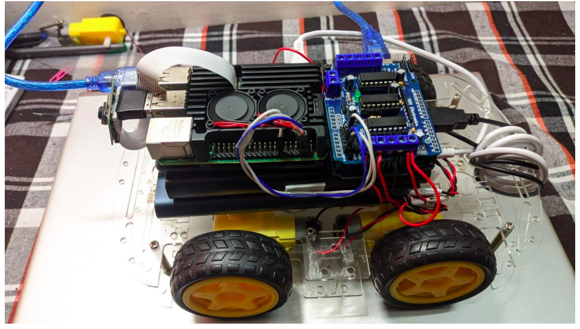

# Differential Drive Robot PWM Control via ROS

This ROS package allows control of a differential drive robot's PWM and direction via joystick inputs. It sends a direction and PWM array to a microcontroller via I2C.

## Files

### joystick.py
This file contains a class that subscribes to ROS Joy node and maps the joystick data to direction and PWM for the motors.

### main.py
This file publishes PWM and direction through a custom message type topic.

### rover_i2c.py
This file writes the array to the Arduino via I2C.

## Installation and Usage
1. Install ROS and Joy package.
2. Clone this repository into the `src` directory of your ROS workspace.
3. Run `catkin_make` to build the package.
4. Connect the microcontroller via I2C.
5. Launch the node by running `rosrun <package_name> main.py`.
6. Use the joystick to control the robot's movement.

## Glimpse

## Credits
This package was created by Devanshu Sharma for personal Project
